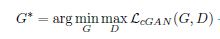
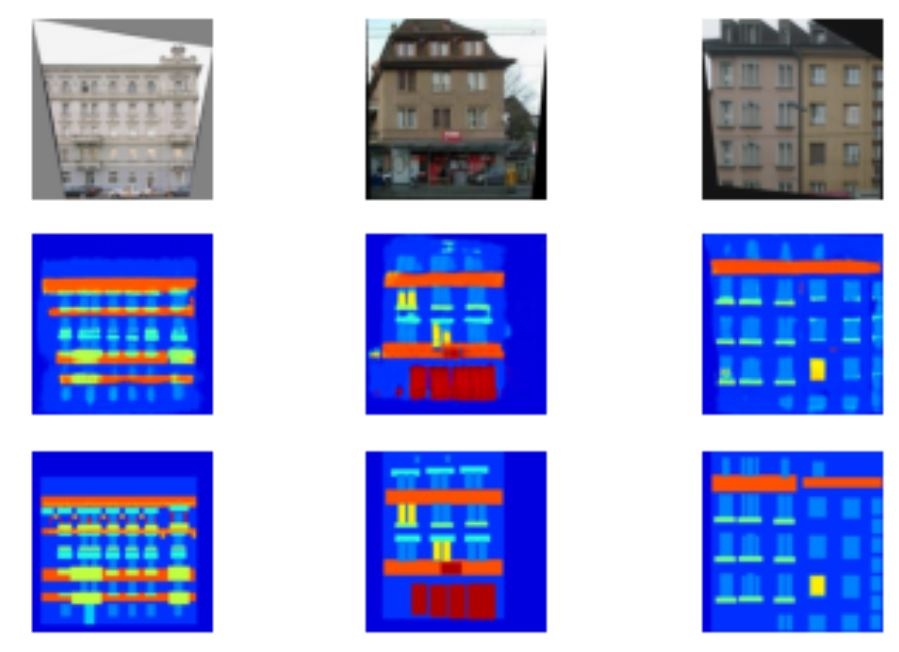

# Image-to-image-translation-using-cGAN
Implementing: https://arxiv.org/abs/1611.07004

Generator is a U-net with skipp connection and Discriminator is a patchGAN. The input to the generator is a series of randomly generated numbers called latent sample. Discriminator is trained using both the original dataset and the images generated by the generator. If the input is from the original dataset, then discriminator should classify it as real and if the input is from the generator, then it should classify it as fake. 

#### Objective of the cGAN is:

# Prerequisite:
* Keras
* Tensorflow 2.0
* Numpy
* Matplotlib

# Dataset:
This model can be used on different datasets. Few of the available dataset can be found https://people.eecs.berkeley.edu/~tinghuiz/projects/pix2pix/datasets/ 

I have used facades dataset in this case.

# Results:

First row indicates the source images, middle row is for generated images from the generator and the last row is for the target images.
Reffer for detailed understanding of the GAN: 
